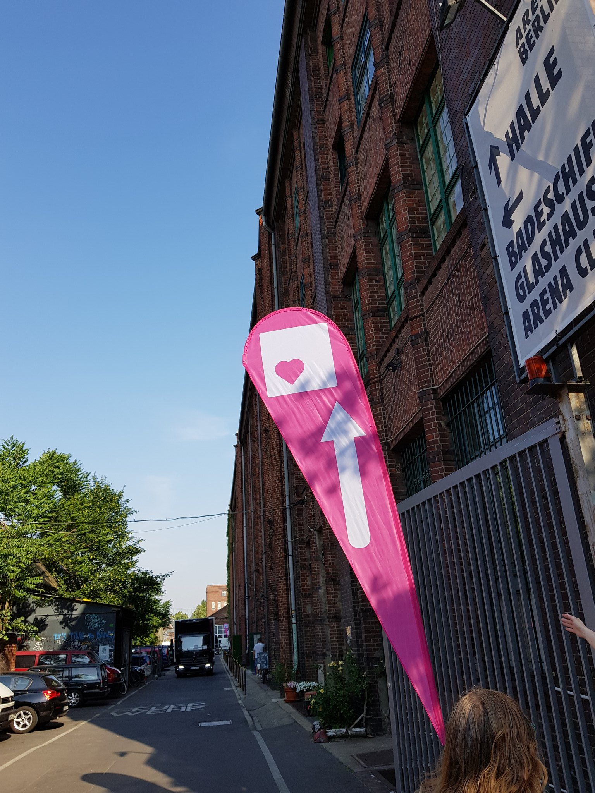
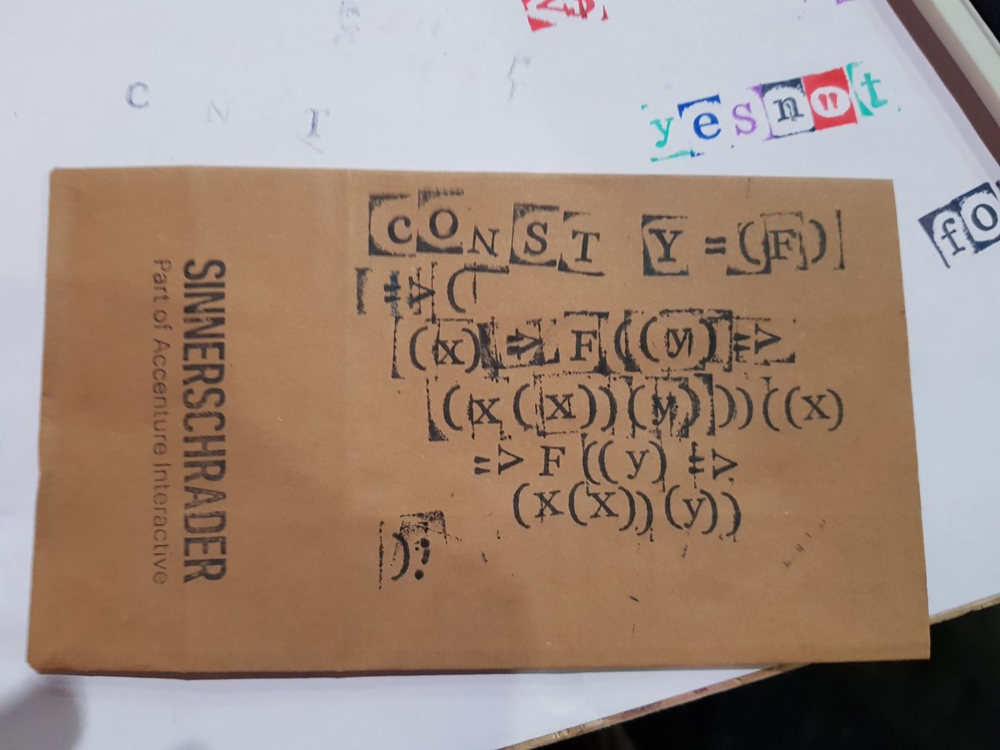

At the beginning of this month I had the privilege to visit [CssConfEu](https://2018.cssconf.eu/)
and [JsConfEu](https://2018.jsconf.eu/) for the first time.

This post doesn't have a coherent direction and I don't intend on comming up with one.
Still I'd like to write down a few misc notes - so let's try that!



* Talks have been recorded and are available on [YouTube](https://www.youtube.com/playlist?list=PL37ZVnwpeshG2YXJkun_lyNTtM-Qb3MKa) - go and watch some! They're really good!
* Conference participants and speakers appeared to be a diverse, colorful crowd. Many happy people and a friendly, open atmosphere.
  * A friend from work already visited before and this made navigating the conference more fun.
* This conference is carried by sponsors, which is a contrast to most of the events I've visited so far.
  * To me this brings with it a stronger focus on work.

Experiencing the arch
---
So Mozilla had a thing in collaboration with Ian Brill called [the arch](https://experiencethearch.com/). It was beautiful. Here's why:

<video style="width: 100%" controls>
  <source src="colors.mp4" type="video/mp4" />
</video>

It was a tunnel of color lit cells together with an invitation to program an animation for it.

| The arch flyer, front               | The arch flyer, back                |
| :---------------------------------- | :---------------------------------- |
|  |  |

Because I had done [something similar](https://twitter.com/sicarius/status/901087830381875200) before
I had the idea to get a [particular video](https://www.youtube.com/watch?v=DLzxrzFCyOs) on the arch.

First I needed to get hold of the material and get it into shape.
So I dug out a few console commands:
```bash
# Download video:
youtube-dl "https://www.youtube.com/watch?v=oHg5SJYRHA0"
# Resize video to desired resolution:
ffmpeg -i RickRoll\'D-oHg5SJYRHA0.mp4 -vf scale=44:36 smallRolled.mp4
# Cut video to desired length:
ffmpeg -i smallRolled.mp4 -t 00:00:30 shortSmallRolled.mp4
# Export video frames with the desired frame rate:
ffmpeg -i shortSmallRolled.mp4 -r 35/1 frames/frame-%03d.bmp
```
I gathered the resulting frame images in an array and went ahead to build a script to get the frames into JavaScript.
A friend found the [pixel-bmp](https://github.com/59naga/pixel-bmp/) library which would come in handy in parsing the frame data.
I later discovered that the uncompressed data led to too big of a script so that I decided to drop every second frame.
From this I came up with the following code:

```javascript
const frameNames = require('./framenames.json');
const fileNames = frameNames.map(f => `./frames/${f}`);

const pixelBitmap = require('pixel-bmp');

const fData = [];

const finish = Promise.all(fileNames.map((fName, fIndex) => {
  if ((fIndex % 2) === 0) {
    return;
  }

  return pixelBitmap.parse(fName).then(([image]) => {
    const frame = [];

    for(let i = 0; i < image.data.length; i+=4) {
      frame.push({
        r: image.data[i],
        g: image.data[i+1],
        b: image.data[i+2],
      });
    }

    fData[Math.floor(fIndex / 2)] = frame;
  });
}));
```

I [later discovered](https://twitter.com/sicarius/status/1002902186072924160) that the image as read from the frames
needed to be transposed to prevent ending up with weird images
and it took me a moment to get a function to correct for the indices:

```javascript
function frameMod(i, sliceSize, total) {
  const drift = i * sliceSize;
  const rem = Math.floor(drift / total);

  return Math.floor((i * sliceSize + rem) % total);
}
```
The thing particularly nice about `frameMod` was that it was easily testable
because I knew the index mapping needed to look like this:
```javascript
[ 0, 1, 2,
  3, 4, 5,
  6, 7, 8,
].map(i => frameMod(i, 3, 9)) ≣ [
  0, 3, 6,
  1, 4, 7,
  2, 5, 8,
];
```

Next I would just print the data to console and pipe that into a file:
```javascript
finish.then(() => {
  const transposedFrameData = fData.map((frame) => {
    const transposedFrame = [];

    for (let i = 0; i < frame.length; i++) {
      const px = frame[frameMod(i, 44, frame.length)];

      transposedFrame.push(
        px.r,
        px.g,
        px.b,
      );
    }

    return transposedFrame;
  });

  console.log(`const frameData = ${JSON.stringify(transposedFrameData)};`);
});
```

Time to stick it together!
Instead of interpolating between frames I decided to just show every frame twice
to accomodate for the dropped frames.

```javascript
const frameData = require('./frameData');

function writeFrame(frameIndex, frame) {
  const wantedFrame = frameData[Math.floor(frameIndex / 2)] || [];

  for (let i = 0; i < frame.length; i++) {
    frame[i] = (wantedFrame.length > 0)
      ? wantedFrame[i]
      : Math.floor(Math.random() * 255);
  }
}

export function transform(buffer, rows, cols, frameCount, fps, isFirst) {
  const frameSize = 3 * rows * cols;
  for (let i = 0; i < frameCount; i++) {
    const frame = new Uint8Array(buffer, frameSize * i, frameSize);
    writeFrame(i, frame);
  }
}

export default function () {
  return Promise.resolve({
    transform,
  })
}
```

Half a day of hunting strange bugs later there was one more conference that's not a stranger to love.

<video style="width: 100%" controls>
  <source src="success.mp4" type="video/mp4" />
</video>

Getting sidetracked with the Y-Combintor
---

At the booth of SinnerSchrader they offered the chance to play with stamps and customize a paper bag that one could fill with snacks afterwards.

I had loads of fun trying to imprint a JavaScript [y-combintor](https://en.wikipedia.org/wiki/Fixed-point_combinator) onto a paper bag.

The source code I was going for should have looked like this:
```javascript
const Y = (F) => (
  (x) => (x(x))
)(
  (x) => (F((y) => x(x)(y)))
);
```
Without the excessive parenthesis you can end up with an example a bit more clearer
which I found on [blog.klipse.tech](https://blog.klipse.tech/lambda/2016/08/10/pure-y-combinator-javascript.html):
```javascript
const Y = f => (x => x(x))(x => f(y => x(x)(y)));
```

Here are some example usages:
```javascript
const fac = Y(f => n => (n === 0 ? 1 : n * f(n-1)));
// fac(5) -> 120
const fib = Y(f => n => (n < 2 ? n : (f(n - 1) + f(n - 2))));
// [0, 1, 2, 3, 4, 5, 6, 7, 8].map(fib) -> [0, 1, 1, 2, 3, 5, 8, 13, 21]
```

The real beauty behind this is that recursion itself can be abstracted away
and we could even enhance the calls of `f` to add additional magic.
Indeed [blog.klipse.tech](https://blog.klipse.tech/lambda/2016/08/10/y-combinator-app-javascript.html) also has a nice example of this where they demonstrate how one can use this to add memoization.

